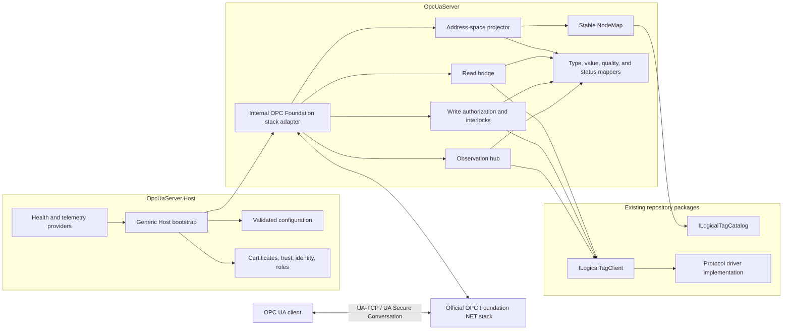
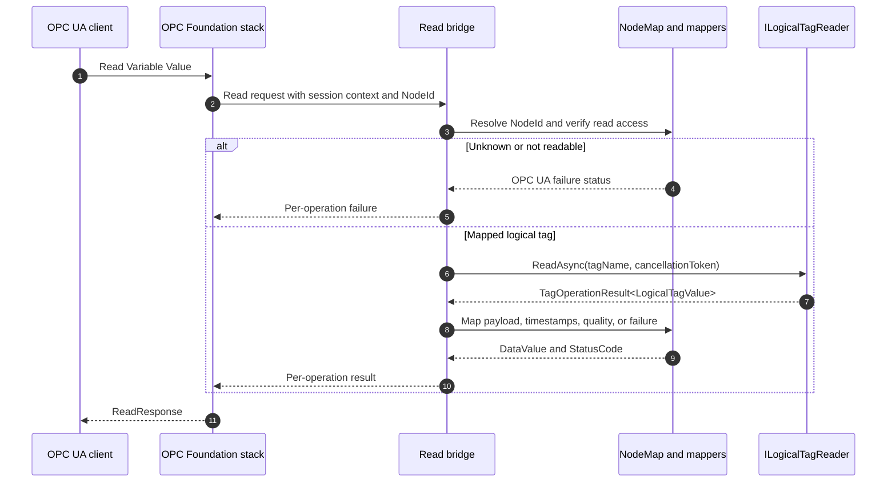
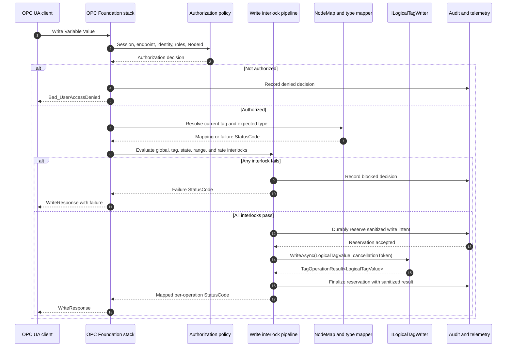

# OPC UA Server Implementation Design

| Field | Value |
|---|---|
| Status | Proposed design |
| Implementation start | **After the current PR is completed and merged** |
| Initial delivery | Secure OPC UA client/server Data Access over UA-TCP |
| Primary integration | `IoT-Driver.Core` logical-tag contracts (assembly `CP.IoT.Core`) |
| Last updated | 2026-07-31 |

> This document specifies a new implementation. It does not expand the scope of the current PR. No `OpcUaServer` code or package should be introduced until that PR is complete.

## 1. Status and decision legend

| Marker | Meaning |
|---|---|
| **DECIDED** | Approved design direction; implementation should follow it unless superseded by an ADR. |
| **REQUIRED** | A testable requirement for the initial release. |
| **DEFERRED** | Intentionally excluded from the initial release. |
| **TBD** | A value or choice that must be resolved before the named implementation gate. |

Requirement identifiers are stable references for issues, tests, ADRs, and release evidence. A requirement may only be removed or materially changed by updating this document and recording the decision.

## 2. Executive summary

The new `OpcUaServer` feature will expose existing `IoT-Driver.Core` logical tags as OPC UA Data Access Variables. The bridge will compose an `ILogicalTagClient`, an `ILogicalTagCatalog`, a deterministic `NodeMap`, mapping services, and small stack adapters. The OPC Foundation .NET stack will own OPC UA protocol mechanics, including message encoding, UA-TCP transport, SecureChannels, sessions, services, subscriptions, and monitored-item delivery.

The initial release is deliberately narrow:

- one or more configurable UA-TCP endpoints;
- Browse, Read, Write, and Subscription/MonitoredItem behaviour for mapped logical tags;
- stable, feature-owned NodeIds;
- application-certificate trust, authenticated users, role authorization, and safe write interlocks;
- lifecycle, diagnostics, structured logging, metrics, and health state suitable for a .NET Generic Host; and
- automated TUnit tests running on Microsoft Testing Platform (MTP), plus OPC UA interoperability and conformance evidence.

This is not a ground-up OPC UA stack. It is a composition-based integration with the official stack. Features such as HTTPS, Historical Access, PubSub, REST, a configuration UI, high availability, cloud bridges, containers, and orchestration remain outside the initial release.

## 3. Goals and non-goals

### 3.1 Goals

- **G-001 — REQUIRED:** Present `IoT-Driver.Core` logical tags through a standards-based OPC UA Data Access address space.
- **G-002 — REQUIRED:** Preserve protocol independence in `IoT-Driver.Core` and every existing driver package.
- **G-003 — REQUIRED:** Use deterministic NodeIds that remain stable across restarts and ordinary catalogue edits.
- **G-004 — REQUIRED:** Make secure deployment the default and make write access an explicit, layered opt-in.
- **G-005 — REQUIRED:** Keep hosting, certificate-store configuration, user authentication, and process concerns outside the reusable bridge library.
- **G-006 — REQUIRED:** Reuse one upstream logical-tag observation per tag where practical and bound all queues and concurrency.
- **G-007 — REQUIRED:** Produce test and operational evidence sufficient to make a release decision.
- **G-008 — REQUIRED:** Prefer composition. Any inheritance required by an OPC Foundation stack extension point is confined to an internal adapter that delegates to composed services.

### 3.2 Non-goals for the initial release

- **NG-001 — DEFERRED:** HTTPS, WebSocket, or SOAP bindings.
- **NG-002 — DEFERRED:** Historical Access, aggregates, historian storage, and durable history.
- **NG-003 — DEFERRED:** OPC UA PubSub over MQTT, AMQP, UDP, or any other transport.
- **NG-004 — DEFERRED:** REST APIs, browser UI, desktop UI, address-space editor, or remote administration UI.
- **NG-005 — DEFERRED:** Methods, Alarms and Conditions, and a project-specific event model.
- **NG-006 — DEFERRED:** Runtime NodeManagement exposed to OPC UA clients and arbitrary NodeSet import/export.
- **NG-007 — DEFERRED:** Companion-specification models.
- **NG-008 — DEFERRED:** High availability, clustering, session replication, or horizontal scaling.
- **NG-009 — DEFERRED:** Cloud connectors, container images, Kubernetes, Helm, and container orchestration.
- **NG-010 — DEFERRED:** Changing existing driver catalogues, addresses, source generators, or transport behaviour.
- **NG-011 — DEFERRED:** Certifying that the product conforms to an OPC Foundation profile. Compliance tooling may provide evidence, but certification is a separate product decision.

## 4. Current repository integration

### 4.1 Existing contracts

The implementation will integrate with the `IoT.Driver.Core` namespace and the following contracts from the `IoT-Driver.Core` package (assembly/project `CP.IoT.Core`):

| Contract | Use in the OPC UA feature |
|---|---|
| `ILogicalTagCatalog` | Supplies an ordered tag-definition snapshot and change events. |
| `ILogicalTagReader` | Performs single and ordered batch reads. |
| `ILogicalTagWriter` | Performs single and ordered batch writes. |
| `ILogicalTagObserver` | Supplies `IObservable<LogicalTagValue>` and `IAsyncEnumerable<LogicalTagValue>` change streams. |
| `ILogicalTagClient` | Composes reader, writer, and observer capabilities. |
| `IManagedLogicalTagClient` | May be supplied by a host, but the server does not require or mutate its setup/persistence surface. |
| `LogicalTag` | Supplies `Name`, protocol-specific `Address`, declared `DataType`, `GroupName`, `Description`, metadata, `AccessMode`, and optional `ScanInterval`. |
| `LogicalTagValue` | Supplies tag name, payload, UTC timestamp, and an optional string quality code. |
| `TagOperationResult<T>` | Represents expected operation success or failure without requiring an exception. |

The feature must respect the contracts as they exist:

- tag names are ordinal and are the only repository-wide logical identity available to the bridge;
- `DataType` and `Quality` are strings and are not a shared closed enum;
- an operation failure has an error message, not a protocol-neutral error code;
- `LogicalTagAccessMode` defines the driver-facing read/write capability;
- catalogue changes are events, while `List()` provides a stable ordered snapshot; and
- the observable and async-enumerable surfaces have different lifetime mechanics but equivalent value semantics.

### 4.2 Integration constraints

- **INT-001 — REQUIRED:** `OpcUaServer` may reference `IoT-Driver.Core`; `IoT-Driver.Core` must not reference any OPC UA package.
- **INT-002 — REQUIRED:** No existing protocol package may reference an OPC UA package.
- **INT-003 — REQUIRED:** The feature reads logical tag names and source identifiers but does not add OPC UA fields to, or mutate, a driver's catalogue.
- **INT-004 — REQUIRED:** The NodeMap is owned and versioned by the OPC UA feature.
- **INT-005 — REQUIRED:** Driver-specific error and data-type knowledge is added through composed resolvers, not through type checks against concrete drivers in the core bridge.
- **INT-006 — REQUIRED:** The server and host target modern .NET only. The exact .NET 10/.NET 11 target matrix is an open ADR; the `IoT-Driver.Core` target is not changed to accommodate the server.

## 5. Project and package boundaries

### 5.1 Projects

| Project | Deliverable | Responsibilities | Direct dependencies |
|---|---|---|---|
| `OpcUaServer` | Reusable, packable runtime library | NodeMap, address-space projection, value/type/quality/status mapping, read/write bridge, observation fan-out, stack-facing adapters, abstractions, and diagnostics instruments | `IoT-Driver.Core`; the minimum official OPC Foundation Core/Server packages |
| `OpcUaServer.Host` | Non-packable executable | .NET Generic Host composition, configuration binding and validation, endpoints, certificate stores, trust policy, identity/role providers, lifecycle, logging providers, and deployment-specific health exposure | `OpcUaServer`; official configuration/certificate packages; hosting packages |
| `OpcUaServer.Tests` | Non-packable test project | Unit, contract, integration, security, lifecycle, and load-harness tests | Projects under test; TUnit; TUnit Assertions; MTP-compatible test tooling; official OPC UA client package for test clients |

The intended namespace root is `IoT.Driver.OpcUaServer`. Public names should describe domain roles and must not expose SDK types unless interoperability requires them.

### 5.2 Dependency rules

- **PKG-001 — REQUIRED:** `OpcUaServer` must not depend on Generic Host configuration files, certificate-store layout, a UI framework, a metrics exporter, or a concrete driver.
- **PKG-002 — REQUIRED:** `OpcUaServer.Host` owns official stack configuration and certificate dependencies that are not necessary for the reusable logical-tag bridge.
- **PKG-003 — REQUIRED:** `OpcUaServer.Tests` and `OpcUaServer.Host` are never NuGet package deliverables.
- **PKG-004 — REQUIRED:** Official OPC Foundation package versions are centrally pinned in `Directory.Packages.props` after implementation-time compatibility and security review.
- **PKG-005 — REQUIRED:** The selected official packages must remain split by responsibility. Do not use a broad package if the narrower Core, Server, Configuration, and Certificate packages satisfy the dependency graph.
- **PKG-006 — REQUIRED:** The OPC UA packages must not flow into `IoT-Driver.Core` or existing driver packages.
- **PKG-007 — REQUIRED:** Package contents are inspected in CI so the runtime library contains only its intended runtime assemblies and content.

### 5.3 Source-generator isolation

Source generators are unrelated to runtime node mapping. The NodeMap is created at runtime from `ILogicalTagCatalog`; it must not discover or load a source generator.

- **GEN-001 — REQUIRED:** Every source generator remains a separately named, separately packaged `.Generators` project.
- **GEN-002 — REQUIRED:** A source-generator assembly must never be embedded in another library's `lib/` assets or otherwise shipped as part of that library's runtime assembly set.
- **GEN-003 — REQUIRED:** If an OPC UA generator is ever approved, it will be a separate `OpcUaServer.Generators` package with analyzer assets and `PrivateAssets`/asset flow configured for generator use. It is not part of the three-project initial design.
- **GEN-004 — REQUIRED:** Package-content tests must fail if a generator DLL is present in a non-generator package, protecting consumers from duplicate generated namespaces and types.

## 6. Architecture

### 6.1 Component view



### 6.2 Responsibility split

The official OPC Foundation stack owns:

- UA-TCP framing and connection handling;
- UA Binary encoding/decoding;
- SecureChannel creation and renewal;
- session activation and timeout mechanics;
- OPC UA service request/response mechanics;
- subscription, monitored-item, publish, keepalive, and retransmission protocol mechanics;
- standard status, diagnostics, and server nodes supplied by the stack; and
- certificate and token validation primitives exposed by its supported APIs.

The new feature owns:

- host policy and secure configuration;
- application identity and role mapping;
- projection of logical tags into the address space;
- deterministic NodeIds;
- mapping between repository and OPC UA values, types, timestamps, quality, and failures;
- authorization and safe write interlocks before calls reach a driver;
- sharing and supervising driver observation streams;
- application telemetry and health;
- lifecycle coordination; and
- verification of the configured product behaviour.

The feature must not duplicate stack service dispatch, encoders, SecureChannel cryptography, session state machines, or publish algorithms.

### 6.3 Composition rule

Construction is performed through dependency injection using small interfaces such as:

- `INodeMap`;
- `ILogicalTagTypeResolver`;
- `ILogicalTagQualityMapper`;
- `ILogicalTagErrorMapper`;
- `IUaAuthorizationPolicy`;
- `IWriteInterlock`;
- `ILogicalTagObservationHub`; and
- `IOpcUaServerRuntime`.

If the selected stack version requires a server or node-manager base class, one internal sealed adapter may inherit from that SDK type. It must immediately delegate application decisions to the composed services above. No driver, mapping, authorization, or host policy belongs in the inherited adapter.

## 7. Stable NodeMap and address-space model

### 7.1 Namespace and root

- **NODE-001 — DECIDED:** The feature namespace URI is `urn:chrispulman:iot-driver:opcua-server`.
- **NODE-002 — REQUIRED:** Node identity is expressed as `(NamespaceUri, StringIdentifier)`. A runtime namespace index is never persisted or used as identity.
- **NODE-003 — DECIDED:** The project root is an Object beneath `Objects` with NodeId `s=IoTDriver`.
- **NODE-004 — DECIDED:** Logical-tag Variables are organised beneath `Objects/IoTDriver/Tags`; group folders are an organisational view, not part of Variable identity.

### 7.2 Deterministic identifiers

`NodeMap` version 1 uses these identifiers:

| Node | String NodeId |
|---|---|
| Project root | `IoTDriver` |
| Tags folder | `IoTDriver/Tags` |
| Ungrouped folder | `group:` |
| Named group folder | `group:{Base64Url(UTF8(GroupName))}` |
| Logical-tag Variable | `tag:{Base64Url(UTF8(LogicalTag.Name))}` |

Base64Url uses UTF-8 input, no padding, `-` and `_` substitutions, and no case conversion. This is reversible and preserves the repository's ordinal, case-sensitive tag identity. BrowseName and DisplayName retain the human-readable tag or group name.

- **NODE-005 — REQUIRED:** NodeId generation is deterministic, culture-independent, and covered by golden-vector tests.
- **NODE-006 — REQUIRED:** Moving a tag between groups, changing its address, description, metadata, scan interval, or access mode does not change its NodeId.
- **NODE-007 — REQUIRED:** Renaming a logical tag removes the old node and adds a new node because the repository has no immutable identity independent of `Name`.
- **NODE-008 — REQUIRED:** Two tags cannot map to the same NodeId. Any mapping collision or duplicate tag identity is a startup/configuration error, not a warning to ignore.
- **NODE-009 — REQUIRED:** The mapping never writes NodeIds or OPC UA metadata back to an existing driver catalogue.

### 7.3 Address-space projection

Each supported `LogicalTag` becomes a DataVariable with:

| OPC UA field | Source |
|---|---|
| `NodeId` | Versioned NodeMap rule |
| `BrowseName` / `DisplayName` | `LogicalTag.Name` |
| `Description` | `LogicalTag.Description`, when non-empty |
| `DataType` / `ValueRank` | `ILogicalTagTypeResolver` |
| `AccessLevel` | Logical access capability further restricted by server policy |
| `UserAccessLevel` | Session roles and write/read policy |
| `MinimumSamplingInterval` | `ScanInterval` in milliseconds when present; otherwise the stack's indeterminate/continuous convention selected during implementation |
| `Value` | Latest mapped usable `LogicalTagValue`; `null` while unsampled or whenever `StatusCode` severity is Bad |
| `SourceTimestamp` | `LogicalTagValue.TimestampUtc` |
| `ServerTimestamp` | Time at which the server maps/publishes the value |
| `StatusCode` | Quality or operation-error mapper |

Selected metadata keys may later be exposed as read-only Properties only after a namespaced allowlist is defined. Arbitrary metadata must not create Nodes, permissions, or write access.

- **NODE-010 — REQUIRED:** A newly created Variable with no default or sampled value has `Value = null`, no fabricated source timestamp, and `Bad_NoValue` until a successful initial read or observation supplies a value.
- **NODE-011 — REQUIRED:** Every DataValue whose StatusCode severity is Bad has `Value = null`; the bridge never carries a stale process value beneath a Bad status.

### 7.4 Catalogue reconciliation

- The reconciliation feed is registered before the initial `ILogicalTagCatalog.List()` snapshot. Feed events are buffered with a monotonic catalogue version, then replayed in version order after the snapshot so no mutation can fall between snapshot and subscription.
- The initial map is built from one snapshot plus all later-versioned buffered events before endpoints become ready.
- Catalogue change events are serialized through a single reconciliation queue.
- Add and remove operations are idempotent.
- Definition changes are applied as one node update transaction from the bridge's perspective.
- A data-type change validates the new mapping before the old node is replaced. On failure, the old valid projection remains and health becomes degraded.
- A type, rank, or semantic-property change does not silently continue existing monitored items with cached metadata. The bridge uses the stack-supported model-change mechanism, terminates/recreates affected monitored items where required, and sets the `SemanticsChanged` informational bit on the applicable data-change notification so clients re-read metadata.
- Removing a node disposes its shared observation and causes subsequent client operations to return `Bad_NodeIdUnknown`.
- A queue overflow or reconciliation exception fails health and triggers a full snapshot reconciliation; events are never silently discarded.

- **NODE-012 — REQUIRED:** Tests mutate the catalogue at every snapshot/feed handoff point and prove that each version is applied exactly once in order.
- **NODE-013 — REQUIRED:** Type, rank, and semantic-property changes have explicit client-notification and monitored-item lifecycle tests.

## 8. Service behaviour

### 8.1 Required OPC UA service surface

- **FR-001 — REQUIRED:** Expose at least one configurable UA-TCP endpoint.
- **FR-002 — REQUIRED:** Support the Discovery, SecureChannel, Session, View/Browse, Attribute/Read, Attribute/Write, MonitoredItem, Subscription, and Publish behaviour needed by the selected server profile and supplied by the official stack.
- **FR-003 — REQUIRED:** Browse returns the project root, tag folders, supported Variables, attributes, and references consistently with the NodeMap snapshot.
- **FR-004 — REQUIRED:** Read delegates to `ILogicalTagReader`, preserving per-operation success/failure.
- **FR-005 — REQUIRED:** Write delegates to `ILogicalTagWriter` only after every security and safety interlock succeeds.
- **FR-006 — REQUIRED:** Monitored items receive mapped value, quality, and timestamp changes through a bounded observation path.
- **FR-007 — REQUIRED:** Standard server status and diagnostics supported by the selected stack/profile are enabled without reimplementing their information model.
- **FR-008 — REQUIRED:** Unsupported services return the correct stack-generated `Bad_NotSupported` or profile-appropriate result rather than a custom transport response.
- **FR-009 — REQUIRED:** Batch service requests retain independent per-operation StatusCodes.
- **FR-010 — REQUIRED:** The server honours cancellation, request deadlines, configured operation limits, session limits, and subscription limits.

### 8.2 Read sequence



### 8.3 Observation and subscription semantics

- **SUB-001 — REQUIRED:** Multiple monitored items for one logical tag share one supervised upstream observation where compatible.
- **SUB-002 — REQUIRED:** Driver observation is started on first interested monitored item and disposed after the last interested item, subject to a short configurable churn grace period.
- **SUB-003 — REQUIRED:** The bridge uses a bounded latest-value handoff per tag. It does not create an unbounded replay or event queue.
- **SUB-004 — REQUIRED:** OPC UA sampling, queue size, discard policy, publishing interval, keepalive, lifetime, retransmission, and deadband protocol mechanics remain the stack's responsibility.
- **SUB-005 — REQUIRED:** `LogicalTag.ScanInterval`, when present, is exposed as the minimum sampling information; it does not promise that the underlying device can sample faster.
- **SUB-006 — REQUIRED:** An upstream stream failure marks the Variable Bad and starts bounded exponential retry with jitter. Retry state is observable.
- **SUB-007 — REQUIRED:** Unexpected stream completion is treated as unavailable, not as a permanent final value.
- **SUB-008 — REQUIRED:** A cancelled server or removed tag is not retried.
- **SUB-009 — REQUIRED:** Creating the first monitored item for a tag performs one bounded initial read before relying on observation. Until that read or the first observation succeeds, notifications use `Value = null`, no source timestamp, and `Bad_NoValue`.

## 9. Data, type, timestamp, quality, and error mapping

### 9.1 Type resolution

`LogicalTag.DataType` is driver-defined text. The bridge therefore uses an ordered, composable resolver chain. A driver-aware resolver may be registered by the host, followed by a common-alias resolver. Resolution occurs before a node is exposed.

The common resolver initially supports these scalar aliases, case-insensitively:

| Logical aliases | CLR value | OPC UA built-in type |
|---|---|---|
| `Boolean`, `Bool`, `BOOL`, `System.Boolean` | `bool` | `Boolean` |
| `SByte`, `System.SByte` | `sbyte` | `SByte` |
| `Byte`, `System.Byte` | `byte` | `Byte` |
| `Int16`, `Short`, `System.Int16` | `short` | `Int16` |
| `UInt16`, `UShort`, `Word`, `WORD`, `System.UInt16` | `ushort` | `UInt16` |
| `Int32`, `Int`, `DInt`, `DINT`, `System.Int32` | `int` | `Int32` |
| `UInt32`, `UInt`, `DWord`, `DWORD`, `System.UInt32` | `uint` | `UInt32` |
| `Int64`, `Long`, `System.Int64` | `long` | `Int64` |
| `UInt64`, `ULong`, `System.UInt64` | `ulong` | `UInt64` |
| `Single`, `Float`, `REAL`, `System.Single` | `float` | `Float` |
| `Double`, `LREAL`, `System.Double` | `double` | `Double` |
| `String`, `System.String` | `string` | `String` |
| `DateTime`, `System.DateTime`, `System.DateTimeOffset` | UTC instant | `DateTime` |
| `Guid`, `System.Guid` | `Guid` | `Guid` |
| `ByteString` | `byte[]` | scalar `ByteString` |

One-dimensional arrays use the explicit suffix grammar `<element-alias>[]`. Consequently, `Byte[]` and `System.Byte[]` map to a one-dimensional array of OPC UA `Byte`, while only `ByteString` maps to scalar OPC UA `ByteString`. Suffix parsing occurs before scalar-alias lookup so resolver order cannot change rank. Structured values, matrices, and driver-specific types require an explicit resolver and tests.

- **DATA-001 — REQUIRED:** Unsupported or ambiguous declared types are configuration errors and are not exposed as a loosely typed writable Variant.
- **DATA-002 — REQUIRED:** A runtime payload that does not match the resolved type returns `Bad_TypeMismatch`, records a sanitized diagnostic, and is never coerced through culture-sensitive conversion.
- **DATA-003 — REQUIRED:** Numeric narrowing, overflow, NaN/range policy, string-length limits, and array-length limits are explicit and tested before writes.
- **DATA-004 — REQUIRED:** `null` is accepted only for OPC UA types and ranks whose mapping explicitly permits it.
- **DATA-005 — REQUIRED:** All string matching uses ordinal rules; all numeric parsing/conversion is culture invariant.
- **DATA-006 — REQUIRED:** Golden tests prove that `ByteString`, `Byte[]`, and `System.Byte[]` always resolve to the declared DataType and ValueRank independent of resolver registration order.

### 9.2 Timestamp mapping

- `LogicalTagValue.TimestampUtc` maps to the OPC UA `SourceTimestamp`.
- The bridge sets `ServerTimestamp` when it constructs the DataValue.
- A missing value has no fabricated source timestamp.
- Non-UTC values are normalized using the existing `LogicalTagValue` contract.
- A timestamp that cannot be represented by the OPC UA binary `DateTime` mapping is not clamped. The bridge returns `Bad_OutOfRange` with `Value = null`, omits `SourceTimestamp`, records a sanitized diagnostic, and does not publish the unusable value.
- A sentinel timestamp is treated as missing only when that sentinel is explicitly part of the selected driver contract; otherwise it follows the out-of-range rule.
- Host clock synchronization is an operational prerequisite and clock regressions are logged/metricised.

- **DATA-007 — REQUIRED:** Boundary tests cover the OPC UA epoch/range, offset normalization, missing/sentinel policy, and out-of-range rejection.

### 9.3 Quality mapping

Quality mapping is case-insensitive after trimming. The initial common mapping is:

| Logical quality | OPC UA StatusCode |
|---|---|
| empty, `Good`, `OK` | `Good` |
| `Uncertain` | `Uncertain` |
| `Bad` | `Bad` |
| `NotConnected` | `Bad_NotConnected` |
| `NoCommunication`, `CommunicationFailure` | `Bad_NoCommunication` |
| `OutOfService` | `Bad_OutOfService` |
| `DeviceFailure` | `Bad_DeviceFailure` |
| `SensorFailure` | `Bad_SensorFailure` |
| `WaitingForInitialData` | `Bad_WaitingForInitialData` |
| unknown non-empty value | `Uncertain` plus a rate-limited diagnostic |

A driver-specific quality mapper may precede the common mapper. It may make the result more precise but may not convert a bad source quality to `Good`.

### 9.4 Operation-error mapping

The bridge must not parse free-form error text to infer authorization, type, or node identity. Those conditions are detected before the driver call. If a driver returns an unsuccessful `TagOperationResult<T>`:

1. a registered driver-aware `ILogicalTagErrorMapper` may provide a specific OPC UA status;
2. otherwise the result maps to `Bad_DeviceFailure`;
3. the full error is logged only according to the repository's sensitive-data policy; and
4. the client receives a stable, sanitized diagnostic rather than an exception or stack trace.

Unexpected exceptions map to `Bad_UnexpectedError`, increment an error metric, and are logged with correlation context. Cancellation maps according to whether the client cancelled, the server is stopping, or an operation deadline expired.

Every unsuccessful result and unexpected exception produces a Bad DataValue with `Value = null`. The bridge may retain the last usable value internally for diagnostics or later recovery, but it does not return that stale value with a Bad status.

## 10. Security and threat model

### 10.1 Security posture

- **SEC-001 — REQUIRED:** Production endpoints use UA Secure Conversation with message signing and encryption.
- **SEC-002 — REQUIRED:** `SecurityPolicy#None` and anonymous access are disabled by default. Any development-only enablement is explicit, environment-gated, visibly logged, and rejected by production configuration validation.
- **SEC-003 — REQUIRED:** Each host instance has an ApplicationInstanceCertificate whose ApplicationUri and endpoint identities validate.
- **SEC-004 — REQUIRED:** Trust decisions use configured trusted peer/issuer stores and revocation information. Untrusted certificates are rejected by default; there is no automatic acceptance in production.
- **SEC-005 — REQUIRED:** Private keys and trust stores use least-privilege OS permissions or an approved protected store. Secrets are never committed to configuration or source.
- **SEC-006 — REQUIRED:** Certificate expiry, rejection, revocation failures, and trust-list changes are observable and auditable.
- **SEC-007 — REQUIRED:** User authentication and role mapping are host-provided policies. Credentials are never validated or stored by `IoT-Driver.Core`.
- **SEC-008 — REQUIRED:** Node permissions are evaluated for every Session and operation; browse visibility alone does not grant read or write permission.
- **SEC-009 — REQUIRED:** Security policy/profile selection is made against the official stack's supported and currently recommended set at implementation time and captured in an ADR.
- **SEC-010 — REQUIRED:** Sensitive values, credentials, tokens, certificates' private material, and write payloads are not logged.
- **SEC-011 — REQUIRED:** An implementable non-anonymous read role and its identity/token provider are selected before any projected tag node can be exposed in Phase 2.

### 10.2 Threats and controls

| Threat | Primary controls | Residual/operational concern |
|---|---|---|
| Rogue client or server spoofing | Application certificates, trust lists, revocation checks, ApplicationUri validation | Trust-store administration and certificate lifecycle remain operational responsibilities. |
| Man-in-the-middle, tampering, or replay | UA Secure Conversation, signed/encrypted endpoint, official stack sequence and token handling | Insecure policies must remain disabled in production. |
| Credential disclosure | Encrypted channel, no secret logging, host identity provider, bounded authentication attempts | External identity stores and endpoint hosts must also be secured. |
| Unauthorized reads | Session role policy, per-node `UserAccessLevel`, least privilege | Data classification and role assignment are deployment decisions. |
| Unsafe or unauthorized writes | Layered write interlocks in section 10.3 | OPC UA cannot make an intrinsically unsafe plant command safe by itself. |
| Denial of service | Session, request, node, subscription, queue, message, array, and operation limits; rate limits; timeouts | Capacity limits require measured performance gates. |
| Malformed values or type confusion | Official decoder, strict type resolver, size/range validation, no culture-sensitive coercion | Driver-specific structures remain unsupported until explicitly modelled. |
| Compromised host or private key | Protected key store, least-privilege service account, audit, rotation/revocation procedure | Host hardening and incident response are outside the library. |
| Stale or misleading process data | Source timestamp and quality propagation, bad status on disconnect, health telemetry | Device clocks and driver quality must be trustworthy. |
| Configuration tampering | Restricted configuration paths, startup validation, immutable runtime security settings where possible | Deployment system must provide integrity and access control. |

### 10.3 Safe write interlocks

Writes are disabled by default. A write reaches `ILogicalTagWriter` only when all checks below pass, in order:

1. the server is running and accepting writes, not starting, draining, degraded beyond policy, or stopping;
2. global `Writes.Enabled` is `true`;
3. the endpoint uses a configured signed-and-encrypted security mode and an allowed SecurityPolicy;
4. the Session has an authenticated, non-anonymous identity;
5. the identity maps to a role allowed to write the target node;
6. the NodeId maps to a current logical tag;
7. `LogicalTag.AccessMode` permits writes;
8. the tag appears in the host's explicit write allowlist;
9. every configured per-tag interlock succeeds;
10. the incoming value has the exact expected type/rank and passes length, numeric range, enum, rate, and domain validation;
11. per-session, per-node, and global write concurrency/rate limits have capacity; and
12. the audit sink durably accepts a pre-dispatch write intent/reservation without containing secret or sensitive payload data.

Metadata alone cannot enable writes. A tag that permits writes at the driver layer remains read-only in OPC UA until host policy opts it in. Safety-critical command, reset, motion, and recipe operations are denied in the initial release unless an ADR defines a purpose-built interlock and acceptance test.

No failed or timed-out write is automatically retried: the device may have accepted it even if acknowledgement was lost. Optional read-back verification is a separate configured interlock and must not be represented as atomic device confirmation.

- **WRITE-001 — REQUIRED:** Failure of any interlock returns a precise non-Good StatusCode and never calls the driver.
- **WRITE-002 — REQUIRED:** Multi-node writes are not advertised as atomic. Each operation has its own result.
- **WRITE-003 — REQUIRED:** Write audit data includes time, session/application identity, user/role identity, NodeId, logical tag name, decision, StatusCode, and correlation ID, but not credentials or sensitive payloads.
- **WRITE-004 — REQUIRED:** Disabling writes takes effect for new operations without restarting the process; security-policy relaxation still requires restart.
- **WRITE-005 — REQUIRED:** A removed or changed tag is re-resolved immediately before dispatch to prevent stale-map writes.
- **WRITE-006 — REQUIRED:** A successful durable audit reservation is created before driver dispatch and finalized after the result. Reservation failure prevents dispatch. Finalization failure cannot undo a plant side effect, so the operation is not retried, health becomes Unhealthy, and the client receives the ADR-selected uncertain/failure StatusCode with the correlation ID.

### 10.4 Guarded write sequence



## 11. Configuration

`OpcUaServer.Host` binds configuration into validated immutable option records. Security-sensitive relaxation is validated against the environment before the server starts. The names below are a design contract; exact .NET types are implementation details.

```json
{
  "OpcUaServer": {
    "ApplicationName": "IoT-DriverCore OPC UA Server",
    "ApplicationUri": "urn:replace-with-deployment-specific-instance-uri",
    "ProductUri": "urn:chrispulman:iot-driver-core:opcua-server",
    "Endpoints": [
      {
        "BindUrl": "opc.tcp://0.0.0.0:4840/IoTDriver",
        "AdvertisedUrl": "opc.tcp://opcua.example.invalid:4840/IoTDriver",
        "SecurityPolicies": ["TBD-by-ADR"],
        "AllowSecurityPolicyNone": false
      }
    ],
    "Certificates": {
      "ApplicationStore": "deployment-specific",
      "TrustedPeerStore": "deployment-specific",
      "TrustedIssuerStore": "deployment-specific",
      "RejectedStore": "deployment-specific",
      "AutoAcceptUntrustedCertificates": false,
      "MinimumRemainingValidity": "30.00:00:00"
    },
    "Authentication": {
      "AllowAnonymous": false,
      "IdentityProvider": "deployment-specific",
      "RoleMappingProvider": "deployment-specific"
    },
    "Writes": {
      "Enabled": false,
      "AllowedTags": [],
      "MaximumConcurrent": 1,
      "MaximumPerSessionPerMinute": 0
    },
    "Audit": {
      "RequiredForWrites": true,
      "ReservationTimeout": "TBD",
      "FinalizationTimeout": "TBD"
    },
    "Limits": {
      "MaximumSessions": "TBD",
      "MaximumSubscriptionsPerSession": "TBD",
      "MaximumMonitoredItems": "TBD",
      "MaximumOperationsPerRequest": "TBD",
      "MaximumArrayLength": "TBD",
      "MaximumMessageSize": "TBD",
      "MaximumChunkCount": "TBD",
      "MaximumReceiveBufferSize": "TBD",
      "MaximumSendBufferSize": "TBD",
      "MaximumBrowseResultsPerNode": "TBD",
      "MaximumContinuationPointsPerSession": "TBD",
      "MaximumQueuedPublishRequestsPerSession": "TBD",
      "MaximumRetransmissionQueueSize": "TBD",
      "MaximumAuthenticationAttemptsPerMinute": "TBD",
      "MaximumConcurrentCertificateValidations": "TBD",
      "OperationTimeout": "TBD"
    }
  }
}
```

- **CFG-001 — REQUIRED:** Startup fails before opening an endpoint when required configuration is missing, contradictory, insecure for the selected environment, or outside supported bounds.
- **CFG-002 — REQUIRED:** Errors identify the setting and remediation without exposing secrets.
- **CFG-003 — REQUIRED:** Unknown configuration keys under `OpcUaServer` fail validation in controlled deployment modes to catch spelling mistakes.
- **CFG-004 — REQUIRED:** Secrets and private-key passwords use a host secret provider, never plain committed JSON.
- **CFG-005 — REQUIRED:** Runtime reload is limited to documented safe settings such as write enablement/allowlists and selected limits. Endpoint, certificate, trust, namespace, and SecurityPolicy changes require a controlled restart in the initial release.
- **CFG-006 — REQUIRED:** Effective security posture and limits are logged at startup in sanitized form.
- **CFG-007 — REQUIRED:** `BindUrl` controls local listening only. `AdvertisedUrl` is client-reachable, is returned consistently by discovery/GetEndpoints, and its host identity is covered by the application certificate SAN. NAT, reverse-proxy, and multi-homed selection are explicit deployment configuration and integration-test cases.
- **CFG-008 — REQUIRED:** Every stack-facing resource limit has a finite validated production value, a documented rejection StatusCode, an observable counter, and lower/equal/upper-bound tests.

## 12. Lifecycle and error semantics

### 12.1 Startup

The host starts in this order:

1. bind and validate configuration;
2. initialize logging, metrics, and time services;
3. open and validate certificate/trust stores and the ApplicationInstanceCertificate;
4. construct identity, role, mapping, NodeMap, interlock, and logical-client services;
5. register the versioned catalogue event feed;
6. snapshot and validate the logical-tag catalogue, then replay later-versioned buffered events;
7. build the address space and observation registry;
8. start the official stack and UA-TCP endpoints; and
9. set readiness only after a local stack-level probe and all required dependencies succeed.

There is no partially ready state in which a production endpoint accepts writes before the map, trust policy, and interlocks are valid.

### 12.2 Runtime

- Expected driver failures remain per-operation failures.
- One failing tag does not fail an unrelated item in the same request.
- A systemic catalogue, stack, trust, or observation-supervisor failure changes health and may reject operations according to policy.
- Exceptions do not cross the stack boundary or expose implementation details to clients.
- Background tasks are owned by a lifecycle scope, observed, cancellable, and joined during shutdown.
- Configuration and catalogue reconciliation are serialized and versioned so stale work cannot overwrite a newer snapshot.

### 12.3 Shutdown

Shutdown proceeds in this order:

1. clear readiness and reject new writes;
2. stop accepting new sessions where the stack supports it;
3. cancel catalogue reconciliation and observation retries;
4. allow in-flight reads and writes a bounded drain interval;
5. stop the OPC UA server so subscriptions and sessions close through stack mechanics;
6. dispose shared observations and bridge services; and
7. flush bounded audit/telemetry providers.

A timeout advances shutdown and records which phase did not complete. The process must not hang indefinitely.

- **LIFE-001 — REQUIRED:** Start, stop, and failed-start paths are idempotent.
- **LIFE-002 — REQUIRED:** The host never reports ready before a secure endpoint and valid NodeMap are available.
- **LIFE-003 — REQUIRED:** Cancellation is propagated to logical-tag operations.
- **LIFE-004 — REQUIRED:** An unexpected background-task exit changes health and is never silently ignored.
- **LIFE-005 — REQUIRED:** Shutdown completes within the release gate in section 14 or produces explicit failure evidence.

## 13. Observability and operations

The reusable library emits through standard .NET abstractions and does not select a logging sink, tracing backend, or metrics exporter. The host composes providers.

### 13.1 Logs and audit

Structured events include:

- lifecycle transitions and duration;
- effective endpoint/security posture without secrets;
- certificate expiry/rejection/revocation and trust changes;
- session/authentication outcomes at a rate-limited level;
- catalogue reconciliation version, adds, updates, removals, and failures;
- read/write result category and duration;
- write authorization/interlock decisions;
- observation subscribe/dispose/retry/failure;
- operation-limit rejection; and
- health-state changes.

All events use stable event IDs and correlation fields. High-cardinality tag names and client identities must be controlled in metrics; they may appear in appropriately protected logs/audit records.

### 13.2 Metrics

The initial meter should expose, at minimum:

- server lifecycle state and uptime;
- active/rejected sessions;
- active subscriptions and monitored items;
- catalogue/node counts and reconciliation failures;
- read/write counts, failures, denials, and duration histograms;
- observation count, retries, dropped/coalesced updates, and lag;
- certificate days to expiry;
- bounded queue depth/capacity rejection; and
- unexpected exceptions/background-task exits.

Metric names and units are finalized before implementation merge and tested using an in-memory listener.

### 13.3 Health

| State | Meaning |
|---|---|
| `Starting` | Configuration, trust, address space, or endpoint is not ready. |
| `Healthy` | Secure endpoint is active, NodeMap is current, and required services are functioning. |
| `Degraded` | Endpoint remains usable but a non-global condition such as a failed tag observation or approaching certificate expiry requires attention. |
| `Unhealthy` | Security material, endpoint, stack, NodeMap, or a required background service has failed. |
| `Stopping` | Readiness is false and shutdown is draining. |

- **OBS-001 — REQUIRED:** Telemetry never changes protocol behaviour or blocks the server indefinitely.
- **OBS-002 — REQUIRED:** Production writes fail closed unless a durable pre-dispatch audit reservation is accepted. Post-dispatch finalization failure is reported as an unhealthy, non-retriable indeterminate outcome because the plant side effect cannot be rolled back.
- **OBS-003 — REQUIRED:** Health reports dependency-specific reasons and the last successful NodeMap reconciliation version.
- **OBS-004 — REQUIRED:** Default logs contain no secrets, private-key data, user tokens, or raw sensitive write payloads.

## 14. Performance and capacity gates

No capacity claim is approved by this design. The values below must be measured on named reference hardware with a pinned runtime, stack version, driver/simulator, security policy, payload mix, and sampling/publishing configuration.

| Gate | Release threshold | Must be fixed by |
|---|---|---|
| Address-space node count | **TBD** | ADR before Phase 3 exit |
| Concurrent sessions | **TBD** | ADR before Phase 3 exit |
| Subscriptions per session | **TBD** | ADR before Phase 3 exit |
| Total monitored items | **TBD** | ADR before Phase 3 exit |
| Sustained read operations/second | **TBD** | ADR before Phase 3 exit |
| Sustained write operations/second | **TBD** | ADR before Phase 4 exit |
| Observation-to-Publish p95/p99 latency | **TBD** | ADR before Phase 3 exit |
| Read p95/p99 latency | **TBD** | ADR before Phase 3 exit |
| Write p95/p99 latency | **TBD** | ADR before Phase 4 exit |
| Startup time at target node count | **TBD** | ADR before release candidate |
| Graceful shutdown time | **TBD** | ADR before release candidate |
| Managed memory at steady state | **TBD** | ADR before release candidate |
| Allowed allocation/CPU regression | **TBD** | ADR before release candidate |
| Soak-test duration and allowed error/leak rate | **TBD** | ADR before release candidate |

- **PERF-001 — REQUIRED:** Load tests use the same signed-and-encrypted endpoint posture intended for production.
- **PERF-002 — REQUIRED:** Test results record revised sampling/publishing values and rejected operations; successful throughput alone is insufficient.
- **PERF-003 — REQUIRED:** All queues and concurrency controls have finite configured bounds.
- **PERF-004 — REQUIRED:** A threshold miss is fixed or brought to the owner as an explicit design/product decision. It is not suppressed, averaged away, or converted to a warning-only gate.

## 15. Test and verification strategy

### 15.1 Test framework

- **TEST-001 — REQUIRED:** `OpcUaServer.Tests` uses TUnit and TUnit Assertions only.
- **TEST-002 — REQUIRED:** Tests run through Microsoft Testing Platform (MTP) using repository-standard tooling.
- **TEST-003 — REQUIRED:** No xUnit, NUnit, MSTest, assertion-compatibility facade, or custom assertion shim is added.
- **TEST-004 — REQUIRED:** The Mtpunittestmcp server is used to run or inspect TUnit coverage when it is available in the execution environment.
- **TEST-005 — REQUIRED:** Tests and production builds pass with warnings treated as errors and without warning, analyzer, or test suppression.

### 15.2 Unit and contract tests

Unit tests cover:

- NodeMap golden vectors, culture independence, case sensitivity, restart stability, group moves, renames, and collision rejection;
- common and driver-aware type resolution, arrays, overflow, invalid casts, unknown types, and null handling;
- quality and error mappings, including unknown quality;
- access-level and user-access-level calculation;
- every write interlock independently and in pipeline order;
- guarantee that a denied write never invokes `ILogicalTagWriter`;
- read/write per-item ordering and mixed results;
- catalogue add/update/remove reconciliation and full-snapshot recovery;
- mutation at each catalogue snapshot/feed handoff point, proving no event loss or duplicate application;
- observation sharing, disposal, bounded coalescing, retry, cancellation, and stream completion;
- initial-read/first-observation behaviour, Bad/null DataValues, semantic-change notification, and monitored-item replacement;
- lifecycle idempotence and failed-start cleanup;
- telemetry field redaction, durable audit reservation, and post-dispatch audit-finalization failure; and
- package-content rules, including rejection of generator DLLs in runtime packages.

The test suite uses a deterministic fake `ILogicalTagClient`, fake catalogue, controlled time, and bounded schedulers. Existing `SimulatorLogicalTagClient` may be used where its semantics fit, but tests must not depend on wall-clock sleeps or physical devices.

### 15.3 Stack integration tests

In-process or loopback tests use the official OPC UA client package to verify:

- endpoint discovery and certificate trust;
- allowed and rejected SecurityPolicy/mode combinations;
- valid, invalid, expired, revoked, and untrusted certificates where the test platform permits deterministic stores;
- anonymous/user/certificate identity outcomes selected by ADR;
- Browse and stable NodeIds across restarts;
- Read, Write, mixed per-operation failures, and cancellation;
- subscriptions, revised sampling/publishing intervals, queue overflow/discard behaviour, keepalive, reconnect, and removal;
- status, source timestamp, and server timestamp propagation;
- operation and resource limits; and
- orderly session/subscription closure on shutdown.

Tests use isolated temporary certificate stores and ports. No test auto-trusts a certificate through production code paths.

### 15.4 Interoperability, conformance, and security verification

- Run the applicable OPC Foundation Compliance Test Tool test set against the release candidate when tool access/licensing permits, and retain the report.
- Verify Browse, Read, Write, and Subscription behaviour with at least two independent third-party clients selected for the release matrix.
- Run certificate/trust, malformed input, authorization, resource exhaustion, and write-interlock security tests.
- Perform dependency vulnerability and license review for the pinned official stack packages.
- Treat an OPC Foundation certification submission as a separate approved activity; passing local tool runs is not represented as certification.

## 16. Phased implementation plan

### Phase 0 — Current PR completion and decisions

Entry: the current PR remains the only implementation scope.

Exit:

- current PR is complete and merged;
- this design is reviewed;
- ADRs for target frameworks, official stack package/version, security policies, identity/role provider and initial read role, namespace URI confirmation, endpoint advertisement, audit reservation/finalization, and performance methodology are accepted;
- initial performance thresholds have owners and due gates; and
- an implementation issue map references requirement IDs.

### Phase 1 — Project skeleton and secure host bootstrap

- Add `OpcUaServer`, `OpcUaServer.Host`, and `OpcUaServer.Tests` to the solution.
- Add only the minimum centrally pinned official OPC Foundation packages.
- Establish dependency-boundary and package-content tests.
- Implement validated host options, isolated certificate-store tests, lifecycle state, identity/token validation, the initial non-anonymous read role, and a secure UA-TCP endpoint with no projected driver nodes.
- Confirm stack extension points and confine any required inheritance to internal adapters.

Exit: secure endpoint startup/shutdown and trust tests pass with no warnings or suppressions.

### Phase 2 — Read-only NodeMap and Data Access

- Implement NodeMap version 1 and catalogue reconciliation.
- Implement type, timestamp, quality, and error mappers.
- Project supported logical tags as read-only Variables.
- Implement Browse and Read paths plus health and telemetry.

Exit: stable restart tests, mixed-read integration tests, and read-only interoperability checks pass.

### Phase 3 — Subscriptions and capacity baseline

- Implement the shared observation hub and bounded handoff.
- Integrate monitored-item value/status/timestamp updates.
- Add retry, cancellation, reconciliation, and shutdown behaviour.
- Measure the capacity gates and finalize their release thresholds by ADR.

Exit: subscription interoperability, limit, load, and soak baselines meet the accepted Phase 3 gates.

### Phase 4 — Guarded writes

- Extend the established identity/role policy with write authorization and implement all write interlocks.
- Implement exact type/range validation, rate/concurrency controls, sanitized audit, and no-retry semantics.
- Add write-focused threat tests and production-default validation.

Exit: writes are proven disabled by default; every deny path avoids driver invocation; enabled writes meet security, audit, correctness, and performance gates.

### Phase 5 — Hardening and release candidate

- Run the full build/test matrix through MTP.
- Run interoperability and applicable compliance/security suites.
- Complete vulnerability/license review, operational runbook, certificate rotation/revocation exercise, backup of configuration material, and incident-response drill.
- Capture performance and soak evidence on reference hardware.

Exit: every release acceptance item has retained evidence and no unresolved blocking ADR or requirement.

### Post-MVP candidates

HTTPS, History, PubSub, Methods/events, companion specifications, REST/UI, high availability, cloud integration, containers, and orchestration each require a new design increment and threat/performance analysis. They are not implicit follow-on work.

## 17. Release acceptance criteria

The initial release is acceptable only when all of the following are true:

- [ ] The current PR was completed before OPC UA implementation began.
- [ ] All **REQUIRED** requirements in this document are implemented or explicitly superseded by an accepted ADR.
- [ ] `IoT-Driver.Core` and existing protocol packages have no OPC UA dependency.
- [ ] Only `OpcUaServer` is a reusable runtime package; Host and Tests are non-packable.
- [ ] Runtime package inspection shows no source-generator DLL or analyzer asset.
- [ ] NodeIds are stable across restart, culture, catalogue ordering, group move, and non-name definition changes.
- [ ] Unsupported types and mapping collisions fail explicitly.
- [ ] Production configuration rejects `SecurityPolicy#None`, automatic untrusted-certificate acceptance, and anonymous access unless a later accepted ADR changes the posture.
- [ ] Certificate issuance, trust, expiry, rotation, rejection, and revocation procedures have been exercised.
- [ ] Browse, Read, Write, and Subscription behaviour pass the release interoperability matrix.
- [ ] Writes are disabled by default and every interlock has negative-path evidence.
- [ ] Timed-out writes are not retried.
- [ ] Health, logs, metrics, and audit records are present and verified free of prohibited sensitive data.
- [ ] All queues, sessions, operations, arrays, monitored items, and concurrency have finite limits.
- [ ] Accepted performance, load, and soak gates pass on recorded reference hardware.
- [ ] Applicable Compliance Test Tool output is retained, or tool unavailability is recorded as a release decision without claiming certification.
- [ ] `dotnet build` and all MTP/TUnit tests pass with warnings as errors and without suppressions.
- [ ] Dependency vulnerability/license review has no unresolved release blocker.
- [ ] Operational and incident-response documentation is complete.

## 18. Risks and mitigations

| Risk | Impact | Mitigation |
|---|---|---|
| Reimplementing OPC UA protocol behaviour | Interoperability and security defects | Use the official stack and keep protocol mechanics out of the bridge. |
| Stack API/version change | Rework or security lag | Pin centrally, isolate SDK adapters, review releases, and retain integration tests. |
| Driver-specific `DataType` aliases | Wrong UA DataType or unsafe coercion | Composable resolvers, strict startup validation, and no writable loose Variant fallback. |
| Free-form driver quality/error text | Imprecise StatusCodes | Composable mappers with conservative defaults; do not parse authorization/type meaning from messages. |
| Tag rename changes NodeId | Client configuration break | Document rename semantics, detect map diffs, and provide release/configuration diagnostics. |
| Catalogue churn races with operations | Stale read/write targets | Serialized versioned reconciliation and immediate re-resolution before writes. |
| Duplicate generated namespaces/types in consumer builds | Consumer compilation failure | Keep every generator in a standalone package and inspect package assets in CI. |
| Certificate/trust misconfiguration | Connection failure or unauthorized peer trust | Fail-fast validation, no production auto-accept, expiry/revocation telemetry, and an operational rotation procedure. |
| OPC UA write reaches unsafe plant state | Equipment or personnel harm | Default deny, layered interlocks, explicit allowlist, exact validation, audit fail-closed, and no ambiguous retry. |
| Subscription fan-out exhausts memory/CPU | Denial of service | Shared observation, bounded queues, operation limits, and measured capacity gates. |
| Misleading performance claims | Unreliable deployment sizing | Keep thresholds TBD until measured; record hardware/configuration and enforce accepted gates. |
| Sensitive telemetry disclosure | Credential or process-data exposure | Structured redaction policy, protected audit sink, and automated negative tests. |

## 19. ADRs and open decisions

| ADR | Status | Decision or question | Gate |
|---|---|---|---|
| ADR-001 | **DECIDED** | Use the official OPC Foundation .NET stack; do not implement protocol mechanics. | Design |
| ADR-002 | **DECIDED** | Use composition; confine SDK-required inheritance to internal delegating adapters. | Design |
| ADR-003 | **DECIDED** | Initial transport is UA-TCP with UA Secure Conversation. | Design |
| ADR-004 | **DECIDED** | NodeMap version 1 uses namespace URI plus deterministic Base64Url string identifiers derived from ordinal logical tag/group names. | Design |
| ADR-005 | **DECIDED** | Do not modify `IoT-Driver.Core` contracts or driver catalogues for OPC UA identity. | Design |
| ADR-006 | **DECIDED** | Source generators remain standalone packages and do not participate in runtime NodeMap creation. | Design |
| ADR-007 | **TBD** | Select `net10.0`, `net11.0`, or a supported multi-target matrix for server and host. | Before Phase 1 |
| ADR-008 | **TBD** | Select and pin the official stack release and exact split packages after API, vulnerability, and license review. | Before Phase 1 |
| ADR-009 | **TBD** | Select production SecurityPolicies/profiles supported by the pinned stack and required client estate. | Before Phase 1 |
| ADR-010 | **TBD** | Select user-token types, identity provider, an implementable non-anonymous read role, write roles, and role-to-node policy. | Before Phase 1 |
| ADR-011 | **TBD** | Confirm the namespace, ProductUri, deployment ApplicationUri template, and migration policy before any published client configuration depends on them. | Before Phase 2 |
| ADR-012 | **TBD** | Define driver-aware type/quality/error resolvers required for the first supported driver matrix. | Before Phase 2 |
| ADR-013 | **TBD** | Name reference hardware, workload profiles, tooling, and all numerical performance gates. | Before Phase 3 exit |
| ADR-014 | **TBD** | Select independent interoperability clients and the applicable Compliance Test Tool/profile test set. | Before Phase 5 |
| ADR-015 | **TBD** | Decide whether `OpcUaServer.Host` is released as source/sample, platform binaries, or a separately versioned application artifact. | Before release candidate |
| ADR-016 | **TBD** | Select bind/advertised endpoint rules, SAN coverage, NAT/multi-homed behaviour, and GetEndpoints selection. | Before Phase 1 |
| ADR-017 | **TBD** | Select the durable audit reservation/finalization provider and the client StatusCode for post-dispatch finalization failure. | Before Phase 4 |

## 20. Official references

These references establish OPC UA concepts and stack capability. The requirements in this document remain the project-specific implementation contract.

1. OPC Foundation, [OPC UA Online Reference](https://reference.opcfoundation.org/).
2. OPC Foundation, [OPC 10000-2: Security Model](https://reference.opcfoundation.org/specs/OPC-10000-2/1).
3. OPC Foundation, [OPC 10000-3: Address Space Model](https://reference.opcfoundation.org/specs/OPC-10000-3/full).
4. OPC Foundation, [OPC 10000-4: Services](https://reference.opcfoundation.org/specs/OPC-10000-4/full).
5. OPC Foundation, [OPC 10000-5: Information Model](https://reference.opcfoundation.org/specs/OPC-10000-5/1).
6. OPC Foundation, [OPC 10000-6: Mappings](https://reference.opcfoundation.org/specs/OPC-10000-6/full).
7. OPC Foundation, [OPC 10000-8: Data Access](https://reference.opcfoundation.org/specs/OPC-10000-8/full).
8. OPC Foundation, [OPC 10000-12: Certificate Management](https://reference.opcfoundation.org/specs/OPC-10000-12/7).
9. OPC Foundation, [Certificate management guidance for developers](https://reference.opcfoundation.org/specs/OPC-10000-2/9.4.2).
10. OPC Foundation, [UA-.NETStandard official repository](https://github.com/OPCFoundation/UA-.NETStandard).
